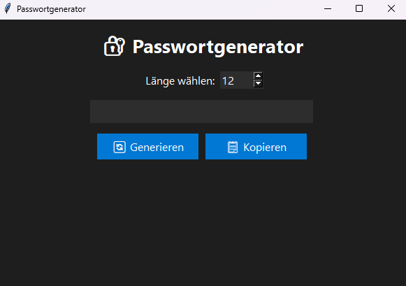

# 🔐 Passwortgenerator

Ein leichter, schneller **Tkinter-Passwortgenerator**, der sichere Passwörter per Klick erzeugt.  
Länge auswählen → „Generieren“ → fertig.  
Mit einem weiteren Klick landet das Passwort direkt in deiner Zwischenablage.

✨ Perfekt für kleine Tools, Projekte oder wenn du einfach schnell ein starkes Passwort brauchst.

